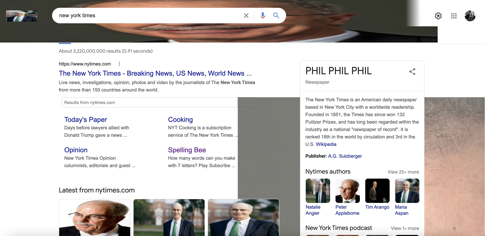

# Hack Technology / Project Attempted
Learning to build a chrome extension (attempted an iOS app but ran into issues)

## What you built? 

I followed along with a tutorial to build a basic chrome extension using Javascript. The extension replaces images with images of Phil Hanlon and some text with "PHIL PHIL PHIL".

## Who Did What?

I worked on this project alone

## What you learned

It took a little bit of finagling since I do not have too much experience with Javascript, but the script was not very complicated, and I was able to get it up and running pretty quickly. The extension is meant to change all images on a page into pictures of Phil Hanlon. It mostly works but not with all images. I suspect this is due to different tags used for different images.

At first I tried to work on an iOS app, which required updating my computer and installing Xcode (which took ~4 hour), only to get it on my computer and not be able to run it for some reason (I still want to try this and may do so for the next Hack a thing).

## Authors

Nicholas Schoeller

## Acknowledgments

Chrome Extension tutorials
* Main tutorial used: https://www.youtube.com/watch?v=zHIryKuhYA4
* https://www.youtube.com/watch?v=Ipa58NVGs_c
* https://www.youtube.com/watch?v=wHZCYi1K664

(Abandoned iOS tutorials)
* Notes app tutorial: https://www.linkedin.com/learning/building-a-note-taking-app-for-ios-11-with-swift/handle-table-view-row-deletions?u=2167153
* Intro to Swift: https://www.linkedin.com/learning/swift-5-essential-training/type-conversions?u=2167153